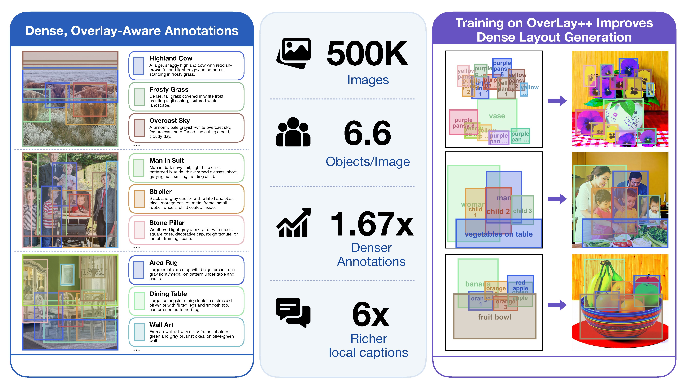
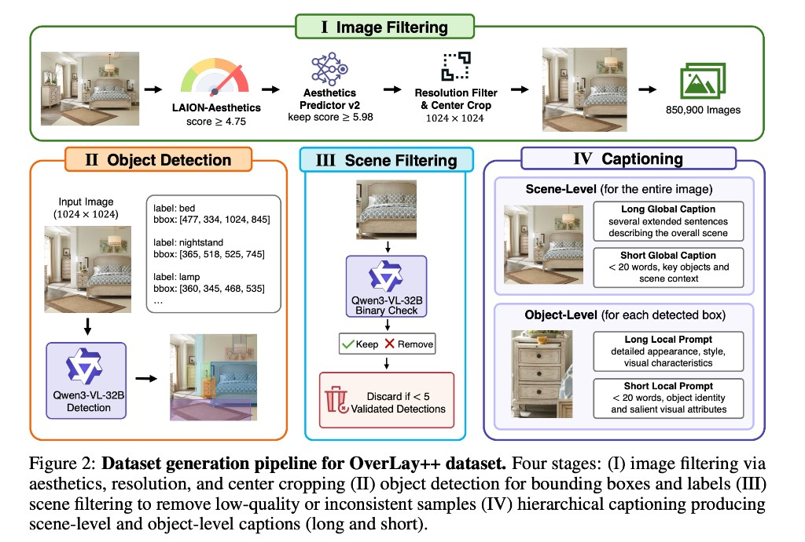

<h1 align="center">OverLay++: Dense-Overlap Layout-to-Image Generation Dataset</h1>

<p align="center">
  <a href="https://arxiv.org/abs/2610.09071">
    
  </a>
  <a href="https://huggingface.co/datasets/mlpcucsd/OverLayPP">
    
  </a>
  <a href="https://mlpc-ucsd.github.io/OverLayPP">
    
  </a>
  <a href="https://youtu.be/1GfSTYlKpSo">
    
  </a>
</p>

<p align="center">
  <a href="https://www.linkedin.com/in/shivanshagg/"><strong>Shivansh Aggarwal<sup>*</sup></strong></a> ·
  <a href="https://shroglck.github.io/"><strong>Shresth Grover<sup>*</sup></strong></a> ·
  <a href="https://dsrivastavv.github.io/"><strong>Divyansh Srivastava<sup>*</sup></strong></a> ·
  <a href="https://scholar.google.com/citations?user=ds8ZvyMAAAAJ&amp;hl=en"><strong>Haiyang Xu</strong></a> ·
  <a href="https://www.bingnanli.com/"><strong>Bingnan Li</strong></a> ·
  <a href="https://xzhang.dev/"><strong>Xiang Zhang</strong></a> ·
  <a href="https://scholar.google.com/citations?user=LE6bioEAAAAJ&amp;hl=en"><strong>Ethan J. Armand</strong></a> ·
  <a href="https://scholar.google.com/citations?user=hoZesOwAAAAJ&amp;hl=en"><strong>Chuan Li</strong></a> ·
  <a href="https://people.stat.ucla.edu/jxie/"><strong>Jianwen Xie</strong></a> ·
  <a href="https://pages.ucsd.edu/~ztu/"><strong>Zhuowen Tu</strong></a>
</p>

<p align="center"><sup>*</sup> Equal contribution</p>

<p align="center"><strong>NeurIPS 2026</strong> · Evaluations &amp; Datasets Track</p>

<p align="center">
  
</p>

---

<div align="justify">

## 📖 Abstract

> Layout-to-Image generation has made substantial progress in spatial and
> object-level control. However, existing methods still struggle with complex
> scenes containing many overlapping and interacting objects. We argue that
> training data is a particular bottleneck: existing datasets lack examples with
> dense, complex object interactions. To address this gap, we introduce
> **OverLay++**, a large-scale Layout-to-Image dataset with structurally complex
> scenes. OverLay++ contains approximately 500K images with an average of 6.6
> objects per image, exceeding existing datasets by 1.67× in annotation density.
> Beyond annotation density, OverLay++ provides rich semantic detail with object
> captions over six times longer than in current datasets. Our dataset
> generation pipeline is simple and produces dense, overlapping object
> annotations with rich per-object captions. Across multiple benchmarks,
> state-of-the-art Layout-to-Image methods trained on the OverLay++ dataset show
> consistent improvement and faster convergence, demonstrating the importance of
> dense, overlap-aware, and caption-rich supervision for controllable image
> generation.

## 🔥 Updates

- **Sep 2026**: The OverLay++ dataset was released on [Hugging Face](https://huggingface.co/datasets/mlpcucsd/OverLayPP).
- **Sep 2026**: OverLay++ was accepted at **NeurIPS 2026**.

## 🚀 Quick Start

### Installation

```bash
git clone https://github.com/mlpc-ucsd/OverLayPP.git
cd OverLayPP
uv sync
```

### Download annotations and prepare images

The download script streams annotations and source URLs from
[Hugging Face](https://huggingface.co/datasets/mlpcucsd/OverLayPP), downloads
the images, and center-crops them to `1024 × 1024`. It also saves copies with
colored object bounding boxes and category labels in `dataset/images_overlayed`:

```bash
uv run python -m overlaypp.download_dataset \
    --images-dir dataset/images \
    --metadata-dir dataset/metadata \
    --images-overlayed-dir dataset/images_overlayed \
    --target-resolution 1024
```

Images are named by `image_hash`, while each matching metadata file retains `url`, `objects`,
`long_global_caption`, `short_global_caption`, and `image_hash`.
Clean images remain in `images`. Rerunning the command creates missing annotated
copies from existing images without downloading them again. Use
`--images-overlayed-dir` to choose a different preview directory; by default it
is created beside `--images-dir`.

For a small test download:

```bash
uv run python -m overlaypp.download_dataset --max-samples 100
```

The resulting directory has the following structure:

```text
dataset/
├── images/
│   └── <image_hash>.jpg
├── images_overlayed/
│   └── <image_hash>.jpg
└── metadata/
    └── <image_hash>_metadata.json
```

To load annotations directly in Python:

```python
from datasets import load_dataset

dataset = load_dataset("mlpcucsd/OverLayPP", split="train")
sample = dataset[0]

print(sample["short_global_caption"])
print(sample["objects"][0]["category"])
print(sample["objects"][0]["bbox"])
print(sample["url"])
```

## Dataset

The [OverLay++ dataset](https://huggingface.co/datasets/mlpcucsd/OverLayPP)
contains 499K annotated examples. Each example provides:

- `objects`: object annotations containing `bbox`, `category`,
  `long_local_prompt`, and `short_local_prompt`
- `long_global_caption`: detailed scene description
- `short_global_caption`: concise scene description
- `url`: original source image URL
- `image_hash`: stable source-image identity

Bounding boxes use image coordinates in `[x1, y1, x2, y2]` format, where
`(x1, y1)` is the top-left corner and `(x2, y2)` is the bottom-right corner
of the object bounding box.

<p align="center">
  
</p>

### Dataset Generation Pipeline

OverLay++ uses a Qwen3-VL vision-language model served with
[vLLM](https://github.com/vllm-project/vllm). The pipeline consists of four
stages:

| Stage | Module | Description |
| :---: | :--- | :--- |
| **I** | `overlaypp.filter_images` | Filter LAION-Aesthetics rows, download images, center-crop to `1024 × 1024`, and initialize metadata. |
| **II** | `overlaypp.detect_objects` | Detect objects and add categories, bounding boxes, and detailed local prompts. |
| **III** | `overlaypp.filter_scenes` | Validate every detected object and discard scenes with fewer than five valid objects. |
| **IV** | `overlaypp.caption` | Generate detailed and short global captions plus concise per-object prompts. |

#### Stage I: Filter and crop source images

To build annotations from LAION-Aesthetics:

```bash
uv run python -m overlaypp.filter_images \
    --parquet-dir /path/to/aesthetics_v2_4.75 \
    --images-dir dataset/images \
    --metadata-dir dataset/metadata \
    --min-score 5.98 \
    --min-resolution 1024 \
    --target-resolution 1024
```

#### Stage II: Detect objects

```bash
uv run python -m overlaypp.detect_objects \
    --images-dir dataset/images \
    --metadata-dir dataset/metadata \
    --batch-size 16 \
    --min-detections 5
```

#### Stage III: Validate scenes

```bash
uv run python -m overlaypp.filter_scenes \
    --images-dir dataset/images \
    --metadata-dir dataset/metadata \
    --min-validated-objects 5
```

By default, rejected metadata and images are deleted. Use `--keep-images` to
retain rejected images for inspection.

#### Stage IV: Generate captions

```bash
uv run python -m overlaypp.caption \
    --images-dir dataset/images \
    --metadata-dir dataset/metadata \
    --batch-size 16
```

The final cleanup removes incomplete records. Use `--no-cleanup` to disable
this sweep or `--keep-images` to retain images associated with dropped records.

The generation scripts retain working metadata fields named `detections`,
`global_caption`, and `local_prompt`. In the published dataset, these correspond
to `objects`, `long_global_caption`, and `long_local_prompt`, respectively.
The generation scripts do not perform this conversion or add `image_hash`;
the download utility preserves the published fields.

### Output Format

Each published metadata file has the following structure:

```json
{
  "url": "https://example.com/source.jpg",
  "objects": [
    {
      "category": "bed",
      "bbox": [477, 334, 1024, 845],
      "long_local_prompt": "A large bed with a tufted upholstered headboard ...",
      "short_local_prompt": "Beige tufted bed with white linen and pillows."
    }
  ],
  "long_global_caption": "A serene bedroom with a large bed ...",
  "short_global_caption": "Cozy bedroom with a bed, lamp, and woven rug.",
  "image_hash": "..."
}
```

## ✒️ Citation

If you find OverLay++ useful, please consider citing:

```bibtex
@misc{aggarwal2026overlaydenseoverlaplayouttoimagegeneration,
  title={OverLay++: Dense-Overlap Layout-to-Image Generation Dataset},
  author={Shivansh Aggarwal and Shresth Grover and Divyansh Srivastava and Haiyang Xu and Bingnan Li and Xiang Zhang and Ethan J. Armand and Chuan Li and Jianwen Xie and Zhuowen Tu},
  year={2026},
  eprint={2610.09071},
  archivePrefix={arXiv},
  primaryClass={cs.CV},
  url={https://arxiv.org/abs/2610.09071},
}
```

</div>
